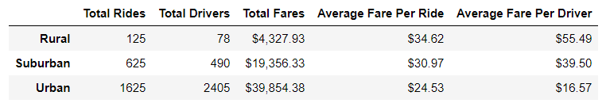
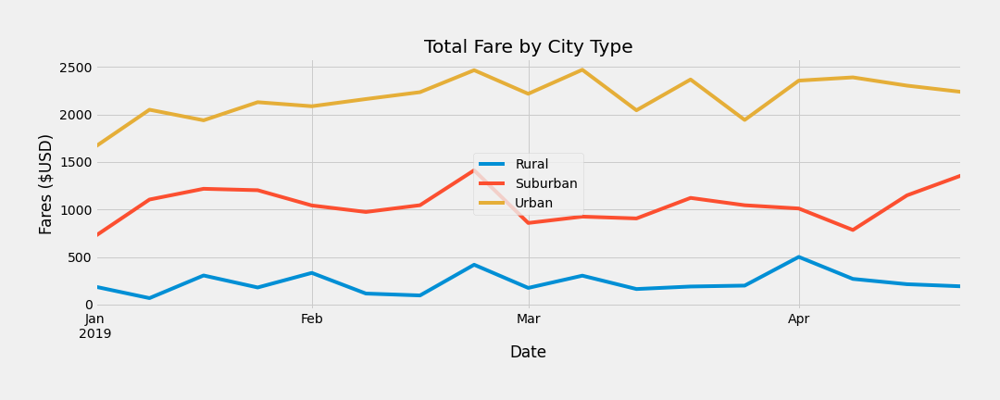

# PyBer Analysis

## Overview 
PyBer is a python based ridesharing company whose CEO wants an analyst to perform a exploratory analysis and create visualizations to showcase relationship between type of city, drivers, riders and fares. This analysis will be used by the decision makers at PyBer to improve access to ride sharing services and determine affordability for underserved neighbourhoods. 

### Purpose 
The purpose of this analysis is to create a summary report to show differences in the total rides, total drivers, total fares, average fare per ride and driver, and total fare by city type and generate a graph to show weekly total fares for city type from January to April 2019.

## Analysis 

The data used in this analysis is PyBer rideshare data from January to early May of 2019. May 2019 data was not used in the second part of the analysis of generating a graph since May 2019 data was incomplete.  

Data Source: [City Data Set](Resources/city_data.csv),
             [Ride Data Set](Resources/ride_data.csv)

Software used: Python 3.7.6, MatPlotLib, Jupyter Notebooks

Analysis Code: [PyBer Challenge](PyBer_Challenge.ipynb)

## Results

**The following table summarizes the data by city type.**

Total rides taken in a urban city is 13 times more than a rural city and about 2.5 times more than a suburban city. 

Urban cities have 30 times more drivers than rural cities and about 5 times more than drivers than suburban cities. However, the drivers in the rural cities earn roughly 3.5 times (roughly $40) more  than the drivers in the an urban city and about 1.5 times (roughly $15) more than drivers in a suburban city. 

The average fare per ride is about $10 more in the rural cities than in urban cities and about $5 more in the rural cities than suburban cities. Ultimately, urban cities bring in about 10 times more revenue than rural cities and 2 times more revenue than suburban cities. 

**The following graph shows total weekly fares by city type for the months of January to April 2019.**

As shown in the graphy, the total weekly fares for rural cities lie roughly between $0 and $500. The total weekly fares for suburban cities lie roughly between $750 and $1500. The weekly fares for urban cities lie roughly between $1600 and $2500. Similar to the result from the table above, the total fares for the urban cities are roughly 10 times more than rural cities and about 2 times more than suburban cities. 

## Summary

Since PyBer wants improve access to ride sharing services and determine affordability for underserved neighbourhoods, here are three business recommendations that may help PyBer improve their services:

1)  PyBer may improve access to ride sharing services in the suburban and rural cities by hiring more drivers and expanding their ridesharing network in these regions. 

2) PyBer may improve affordability for underserved neighbourhoods by reducing the average fare per ride in the suburban and rural cities. 

3) PyBer may monitor their improvements by adding a KPI to track the rides to drivers ratio to measure the access and affordability of their services. As an example, in urban cities where the accessibility and affordability is good, it has a low ratio, compared to the rural cities where the ratio of rides to drivers is very high. 